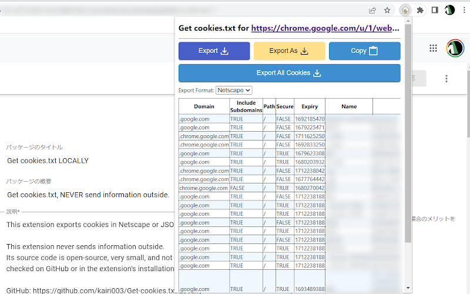

*Read this in other languages: [🇹🇭 ภาษาไทย](README.md), [🇬🇧 English](README_EN.md)*

# 🚀 MEDIA CORE DL: The Ultimate Universal Downloader & Flipbook Extractor


A premium all-in-one web application (Web GUI) for downloading all types of media, including videos, audio, or access-restricted Flipbooks. Equipped with a smart system that seamlessly bypasses member-only restrictions!

## 🆕 What's New in Version 6.1.1 (Hotfix)
- **Cookie Junk Cleanup**: Fixed an issue where temporary cookie files (`cookies_*.txt`) could be left behind in the application folder if the program was unexpectedly closed.

## 🆕 What's New in Version 6.1 (Bug Fixes & Stability)
- **Automatic Image Backup**: Never lose your downloaded images again! If your PC doesn't support creating PDF files, the system will now automatically pack all your images into a comic book format (.cbz) so you always get a complete file.
- **Seamless Multiple Downloads**: Unlock the limits! You can now queue up multiple downloads at the same time smoothly. Even if each download uses a different account or login session, the system will handle them separately without getting confused.
- **Smarter Flipbook Reader**: Say goodbye to the app freezing when it encounters websites with background animations or flashy effects. The new scanner is smart enough to ignore those and will continue reading until the very last page without a hitch.
- **Smart Folder Recovery**: If you accidentally type in the wrong folder name or select a drive that doesn't exist, the app won't crash or close on you. It will gracefully recover and save your files to the default backup folder instead.

---

## 🔥 Key Features

### 🎥 1. Universal Media Engine
Download videos and audio in the highest available quality (High-Quality Extraction). Supports hundreds of websites and platforms globally, including streaming platforms, social media, and specialized video sites.

### 📚 2. Elite Flipbook Extractor
Break the limits of e-book websites! Extract locked pages from **FlipHTML5** and **AnyFlip**, automatically compiling them into high-resolution PDFs (100% automated). Files are automatically named after the real book title.

### 🖼️ 3. Image & Manga Downloader
Download entire photo albums or social media posts (e.g., Facebook) in one click, with support for 3 automatic output formats:
- **Raw Images:** Save individual image files cleanly into a dedicated folder.
- **CBZ (Comic Book Archive):** Package all images into a `.cbz` file for reading in manga apps.
- **PDF Document:** Compile all images into a single high-speed PDF file.

### 🔑 4. Smart Authentication (VIP / Member-Only Bypass)
No more screen recording! With **Cookie Extraction** technology, the system securely borrows session data from your local browser (supports Chrome, Edge, Firefox, Brave, Safari, Opera). 
This allows you to extract videos directly from **Facebook Private Groups**, **Member-Only clips**, or **online courses** you already have access to, just as if you were clicking download yourself!

### ⚙️ 5. Settings Dashboard & Top Bar
Control everything from the top-right menu of the application:
- **Dark / Light Mode:** Instantly switch between a cool dark mode and a clean light mode using the ☀️/🌙 icon on the top bar.
- **Settings Window (⚙️):**
  - **Smart Output Directory:** Click the browse folder icon (🔍) to select the destination folder directly via Windows Explorer.
- **One-Click Maintenance:** Buttons to clear operation logs and temporary cookie files for maximum security and privacy.
- **Netscape Cookie Support:** Manually input custom Netscape cookies on the main page, designed for developers or pro users.

### ⚡ 6. Real-Time Batch Processing UI
- Paste hundreds of links; the system will handle downloading sequentially (Batch Processing).
- Futuristic simulated terminal (Hacker-style GUI) that reports real-time status, download percentages, and speed per second.
- Supports custom file naming via templates (e.g., `media_export_%(title)s`) or automatic naming by Post ID.

### 🤖 7. Smart Screen Capture Bypass (RPA)
- **Record Even with Black Screens:** No more black screen issues when capturing certain apps or e-books. Our system is designed to work with a Virtual Machine to seamlessly extract clear images, even when the source app tries to block screen recording.
- **Human-like Interaction:** Avoid being detected as a bot! The system simulates deep-level mouse and keyboard inputs that act exactly like a real person clicking. This allows you to smoothly bypass anti-bot protections in various apps.
- **Safe & Ban-Free:** Rest easy knowing your accounts won't get suspended. The process runs completely independently (like setting up a physical camera to record a monitor), meaning the source app cannot detect it.

---

## 💿 Standalone Executable (Portable)

Our program is available as a ready-to-use `.exe` file (One-Click) without needing to install Python. It is divided into 2 main versions:

### 1. `MediaCoreDL-Full.exe` (Recommended)
- **File Size:** ~100MB+
- **Key Feature:** The most complete experience, featuring embedded `ffmpeg`.
- **Advantage:** When downloading high-resolution videos from YouTube (1080p, 4K), the system seamlessly merges the separate high-res video and audio tracks, removing quality limits.

### 2. `MediaCoreDL-Lite.exe` (Space-Saver)
- **File Size:** ~35MB
- **Key Feature:** Fast startup, small size, highly portable.
- **Limitation (if ffmpeg is absent):** If used to download YouTube videos at 1080p or higher, YouTube separates the video and audio tracks. Since the Lite version lacks built-in `ffmpeg`, it cannot merge them. It will fallback to the highest quality pre-merged file available (which YouTube usually caps at **720p**).

> 💡 **For Lite users wanting 1080p+:**
> You can easily install `ffmpeg` yourself:
> 1. Go to [FFmpeg Builds (by BtbN)](https://github.com/BtbN/FFmpeg-Builds/releases) 
> 2. Download the `ffmpeg-master-latest-win64-gpl.zip` file
> 3. Extract the zip and open the `bin` folder
> 4. Copy `ffmpeg.exe` and place it in the same folder as `MediaCoreDL-Lite.exe`
> The program will automatically detect it and resume downloading at 1080p+!

---

## 🛠 Prerequisites

- **Python 3.12+**
- **Google Chrome** (required for the PDF Flipbook extraction system)
- *(Optional)* Other web browsers if you wish to use the cookie extraction feature for restricted files.

---

## 📦 Installation

1. **Clone the Repository:**
   ```bash
   git clone <your-repo-url>
   cd "FB DL"
   ```

2. **Install Dependencies:**
   ```bash
   pip install -r requirements.txt
   ```

---

## 🎮 Quick Start

1. **Start the Backend Server:**
   Run the main script via Command Prompt or PowerShell:
   ```bash
   python "FB DL.py"
   ```
2. **Access the Dashboard:**
   Open your web browser and navigate to:
   👉 `http://127.0.0.1:5000`

3. **Configure Settings (Before Downloading):**
   - Click the **Gear icon ⚙️** (top right)
   - Click the search folder icon 🔍 to set your save destination.
   - Toggle **Light Mode ☀️** or **Dark Mode 🌙** to your preference.

4. **Start Downloading:**
   - Select the mode from the top tab: **Video**, **Sound**, **Image**, or **PDF**
   - Paste the target links into the box (supports multiple lines).
   - **Using Custom Cookies (Required for Member-Only / Private Group clips & posts!):** 
     To download login-restricted content, install the **[Get cookies.txt LOCALLY](https://chromewebstore.google.com/detail/get-cookiestxt-locally/cclelndahbckbenkjhflpdbgdldlbecc)** extension on Chrome/Edge.
     
     **🚨 VERY IMPORTANT:** You must **first open and keep the video/image tab (YouTube, Facebook, etc.) running normally**, then click the Extension icon to copy the raw cookie data (Netscape format).
     
     Paste this directly into the **"Custom Cookies"** box in the program (The system relies on this box, 100% success rate!)
     
     <div align="center">
       
     </div>
   - Click the **Download Queue** button and grab a coffee! ☕

---

## 📁 File Storage & Default Output

If you **do not specify** a folder in Settings, the program will save files to the default locations below:
- 📂 **Current Program Directory:** Used for saving **Videos, Audio, Images (Manga), and PDF mode** downloads.
- 📁 **`rpa_output/`** : Used for saving Flipbooks extracted via the **RPA (Virtual Machine) system**.
- 📁 **`dist/`** : (For developers) This folder stores the compiled `.exe` files ready for use.

*(💡 **Note:** However, if you DO configure the Output Directory in Settings (e.g., `C:\Downloads`), **all downloaded files (including RPA)** will be routed to that single specified folder instead.)*

---

## ⚠️ Security & Privacy (Limitations)

- **100% Local Execution:** This program runs entirely on your machine. Passwords and cookies are never sent to external servers. Session cookies are read "temporarily" only when file extraction is required.
- **Headless Chrome:** The Flipbook extraction system stealthily runs Google Chrome in the background (without disrupting your screen). Please do not forcefully close the Chrome process via Task Manager while the system is running.
- **Google Chrome Limitations (App-Bound Encryption):** Due to Google Chrome security updates, automatic cookie extraction may fail (Error #7271). If this happens, please use the **Copy Custom Cookies** method via the extension as detailed in the guide above.

---

## 🤝 Credits & Special Thanks

This project is powered by amazing Open-Source technologies and libraries. Special thanks to:
- **[yt-dlp](https://github.com/yt-dlp/yt-dlp):** The core engine powering the universal video and audio downloader.
- **[gallery-dl](https://github.com/mikf/gallery-dl):** The top-tier powerful tool for extracting images and manga from social media.
- **[img2pdf](https://gitlab.mister-muffin.de/josch/img2pdf):** The fastest lossless library for converting images to PDF.
- **[AnyFlip Downloader (by Lofter1)](https://github.com/Lofter1/anyflip-downloader):** The foundational code and concept for extracting images and merging them into PDFs from Flipbook sites, which was further developed and optimized in this project.
